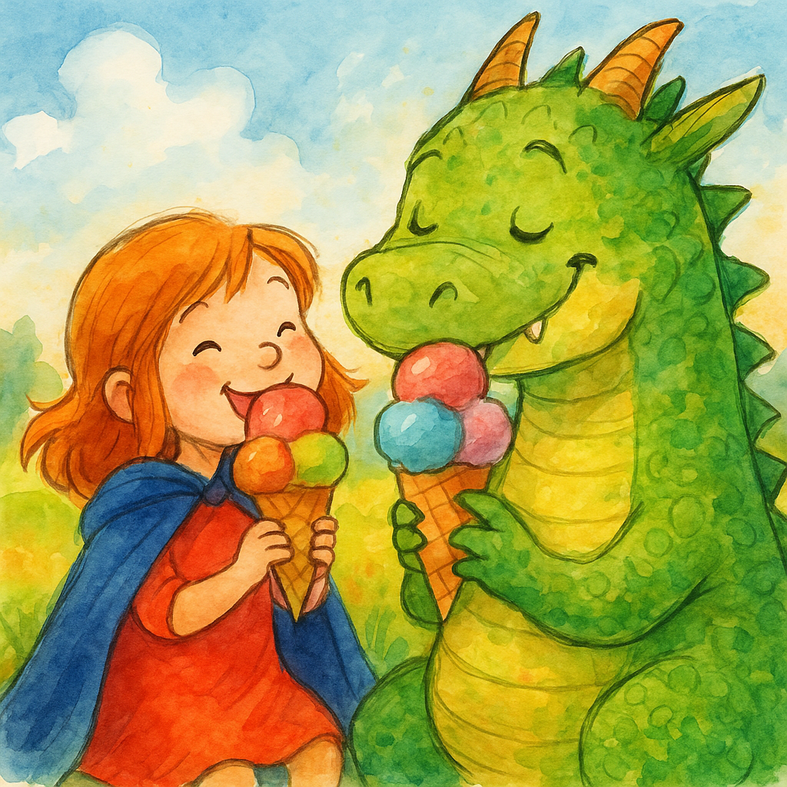

Page 1
She held her wand and closed her eyes,
A dream began beneath the skies,
The stars were bright. The air was wide.

Page 2
She wore a cape. She stood up tall,
She climbed a hill, not scared at all,
A glowing light was by her side.

Page 3
A thunder in the sky,
She looked up high,
A dragon came with flaming eyes.

Page 4
It landed hard with stomping feet,
Its tail swung fast. It breathed out heat.
It gave a growl. The ground went bump.

Page 5
“I’m hungry now!” the dragon cried.
“No food to eat! I’ve searched and tried!”
He huffed. He puffed. His tummy jumped.

Page 6
She didn’t run. She didn’t hide.
She looked at him and stepped aside.
“You must be kind,” she softly said.

Page 7
The dragon frowned and gave a sigh,
“I’m just so hungry. That is why.”
He rubbed his claws and dropped his head.

Page 8
She raised her wand into the sky,
It made a spark. It gave a cry.
The ground began to shake below.

Page 9
A mountain rose from dirt and grass,
Of scoops and cones in every class—
Ice cream! Cold and stacked up high!

Page 10
The dragon blinked. “Is this for me?”
“It’s for us both,” she said with glee.
He gave a smile, a gentle one.

Page 11
They licked and laughed. They took their time.
They shared a scoop with cherry lime.
He made a mess. She didn’t mind.

Page 12
One scoop was blue. One scoop was green.
One tasted just like jellybean.
They both were full. They both were glad.

Page 13
The dragon yawned. He curled up tight.
She laid beside him in the night.
Her wand still glowed with steady light.

Page 14
The stars were soft. The breeze was low.
She watched the sky and let it go.
Her eyes grew heavy, calm, and slow.

Page 15
She woke in bed. The sun was near.
Her wand was there, still shining clear.
She stretched and smiled and touched the floor.