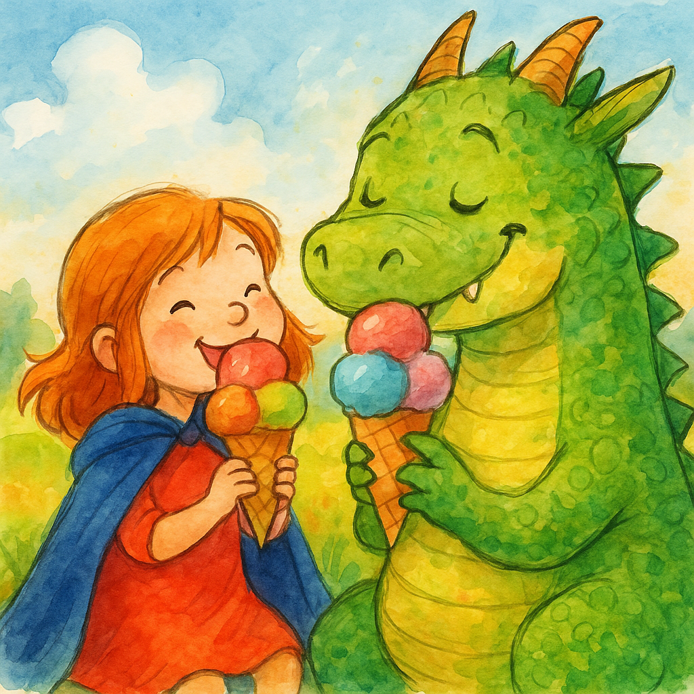

**עמוד 1**
היא אחזה בשרביט בחוזקה,
נמתחה קצת במיטה,
עיניה עצמה לאיטה .

**עמוד 2**
 לפתע גלימה לבשה, זקופה נעמדה,
על הגבעה ממול טיפסה במהרה,
אור זוהר מלווה אותה באהבה.

**עמוד 3**
רעם בשמיים,
היא הרימה עיניים,
דרקון הופיע בסערה.

**עמוד 4**
הוא נחת ברעש, רגליים כבדות,
הזנב הצליף,מהפה יצאו להבות.
הוא נהם בקולי קולות.

**עמוד 5**
"אני רעב!" הדרקון נאנח,
"חיפשתי אוכל, אבל זה מעייף כל כך!"
הוא נשף, הוא רקע, הבטן גרגרה.

**עמוד 6**
היא לא ברחה, לא הסתתרה,
הביטה בו ואז אמרה:
"תהיה אדיב, בבקשה".

**עמוד 7**
הדרקון גירד את ראשו,
"אני פשוט רעב מאוד…"
הוא השפיל מבט, במבוכה.

**עמוד 8**
היא הרימה את השרביט אל על,
ניצוץ נצנץ, אור מילא את החלל,
האדמה רעדה לפתע קלות.

**עמוד 9**
הר של גלידה צמח מהאדמה,
כדורים וחרוטים בכל הצבעים –
קר וצבעוני, התרומם מעלה.

**עמוד 10**
הדרקון פער עיניו בתדהמה,
"זה בשבילי?" שאל את הילדה.
"זה בשביל שנינו," היא חייכה בחזרה.

**עמוד 11**
הם ליקקו בהנאה בלי למהר,
מכל הטעמים דגמו, לפני שיגמר.
הוא עשה בלגן, עכשיו הוא כבר חבר.

**עמוד 12**
כדור כחול, צהוב, ירוק,
אחד בטעם תות – כל כך מתוק.
הם היו מלאים – שמחים ורגועים.

**עמוד 13**
הדרקון פיהק, התכרבל לאט,
היא נשכבה לידו בשקט, כמעט,
השרביט עדיין זהר מעט.

**עמוד 14**
הכוכבים רכים, הרוח נושבת,
היא הביטה בשמיים, את המחשבות שחררה.
עיניה נעצמו, בנחת נרדמה.

**עמוד 15**
היא קמה בבוקר, לשמש זורחת,
השרביט לצידה.
היא התמתחה כמעה וחייכה בגאווה.
